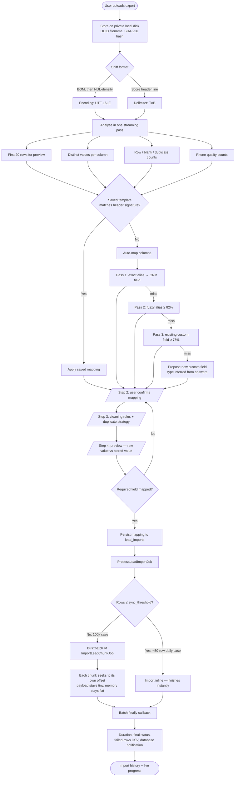
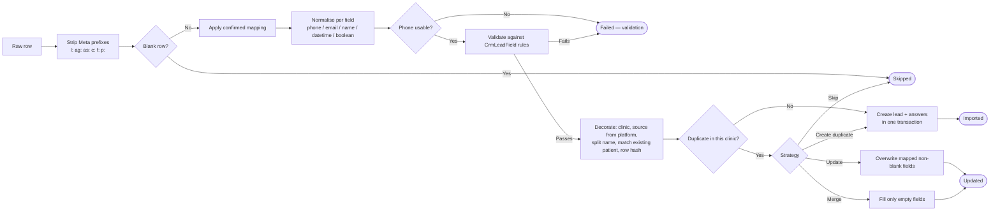

# Facebook Meta Lead Import — Workflow & Reference

How Facebook/Instagram lead-ad exports get into the CRM, what happens to each row on the way, and where to look when something goes wrong.

---

## 1. Why this module is shaped the way it is

Meta lead-ad exports are not ordinary CSVs, and the differences are not cosmetic:

| What you'd assume | What the files actually are |
|---|---|
| UTF-8 | **UTF-16 LE with a byte-order mark** |
| Comma-separated | **Tab-separated**, despite the `.csv` extension |
| Stable columns | The Meta block is stable; **the questions change per lead form** |
| Clean identifiers | Every ID is prefixed — `id=l:…`, `campaign_id=c:…`, and **`phone=p:+91…`** |
| Clean phone numbers | Includes two numbers concatenated into one field, embedded whitespace, and numbers too short to use |
| One answer per question | Multiple-choice answers are **pipe-separated in a single cell** |
| An email column | **There is none.** These forms collect name and phone only |

Handing such a file to `fgetcsv` produces one column of NUL-riddled binary. Every design decision below follows from that reality rather than from a generic CSV importer.

---

## 2. End-to-end flow



### Per-row pipeline



---

## 3. Phone normalisation

The single most important transformation, because a lead with no working number is worthless. Rejecting everything malformed would discard real, contactable people, so anything recoverable is **salvaged and flagged** rather than dropped.

Distribution across the 223 real rows in `tests/Fixtures/leads/`:

| Input | Count | Result | Status |
|---|---|---|---|
| `p:+916367518162` | 199 | `+916367518162` | Valid |
| `p:9887127755` | 18 | `+919887127755` | Valid |
| `p:+918269214285  5` | 1 | `+918269214285` | **Needs review** |
| `p:+9196362378507976709545` (two numbers merged) | 1 | `+919636237850` | **Needs review** |
| `p:+9178510079097752` | 1 | `+917851007909` | **Needs review** |
| `p:+9199839747650` | 1 | `+919983974765` | **Needs review** |
| `p:+91+96891747393` (doubled plus) | 1 | `+919689174739` | **Needs review** |
| `p:9685868` (7 digits) | 1 | — | **Invalid → failure row** |

Salvage rule: strip the prefix and all non-digits, then take the first 10-digit sequence starting 6–9, preferring the one immediately after the country code. `phone_raw` always keeps the untouched original, so no information is destroyed by the guess.

**Only `Invalid` fails a row.** `Needs review` rows import normally and surface via the *Phone quality* filter and a warning icon in the table; editing the lead re-normalises and clears the flag.

---

## 4. Duplicate handling

Matching is always **scoped to the clinic**.

| Match field | Reliability |
|---|---|
| `fb_lead_id` *(default)* | Unique per submission, present on every export row. 223/223 unique across the sample corpus — no false positives. |
| `phone` | Catches one person submitting several forms, but a shared family number matches too. |
| `email` | Only useful for files that actually contain an email column. |

| Strategy | Effect |
|---|---|
| **Skip** *(default)* | Existing lead untouched, row counted as skipped. Safest for re-uploading overlapping exports. |
| **Update** | Overwrites with every mapped **non-blank** value. Blank cells never erase known data; `clinic_id`, `created_by` and `row_hash` are never rewritten. |
| **Merge** | Fills only fields that are currently empty, and adds missing custom answers. A phone number a staff member corrected by hand survives. |
| **Create duplicate** | Always creates a new lead. For when the same person legitimately submitted two different forms. |

A concurrent-chunk collision on the `(clinic_id, fb_lead_id)` unique index is caught and counted as a duplicate, not an error.

---

## 5. Dynamic custom fields

Facebook questions are **never** columns on `leads`.

- `lead_custom_fields` — the question registry. `label` is TEXT because the longest real question is 157 characters. `key` is a 191-char slug, truncated with a hash suffix on overflow.
- `lead_field_values` — the answers. `value` is the raw string, `value_json` holds pipe-split multiple choices, `value_normalized` is the humanised, indexed, searchable form.

Type is inferred from the answers present: every question in the sample exports has ≤ 6 distinct answers, so they become `select` (or `multiselect` when pipes appear) with their options auto-collected. **That is what makes them filterable and chartable** — a plain text column could not support "show me every lead whose main concern is pigmentation".

### The near-duplicate question problem

The real exports contain both:

```
what_is_your_main_skin_concern?
what_is_your_main_skin_concern_right_now?
```

These are the same question worded differently. Left alone they become two unrelated fields and every report on skin concern silently splits in half. Two defences:

1. The auto-mapper's third pass ranks existing fields by similarity and **suggests** the match on the mapping screen (it does not auto-merge — "...right now?" may genuinely be a different question).
2. **Lead Questions → Merge** moves every answer into a chosen target field and deactivates the source. A lead that already answered the target keeps that answer.

---

## 6. Schema reference

| Table | Holds |
|---|---|
| `lead_imports` | One row per uploaded file: detected format, mapping, settings, counters, timing, batch id |
| `leads` | The lead. Clinic-scoped. Unique on `(clinic_id, fb_lead_id)` |
| `lead_custom_fields` | Question registry — label, type, collected options, usage count |
| `lead_field_values` | Answers. Unique on `(lead_id, lead_custom_field_id)` |
| `lead_mapping_templates` | Saved mappings, keyed by a signature over sorted headers |
| `lead_import_failures` | Every failed row with its raw data, so it can be exported and replayed |
| `lead_import_logs` | Lifecycle audit trail shown on the import detail screen |

---

## 7. Performance

- **Nothing is ever loaded whole.** The UTF-16 → UTF-8 conversion happens in a stream filter, rows arrive through a generator, and chunk jobs use `Statement::offset()->limit()` to seek.
- Peak memory is independent of file size — a 100k-row import costs the same per worker as a 100-row one.
- Chunk jobs carry an offset and a length, not rows, so queue payloads stay tiny.
- Counters use atomic `increment()` so parallel chunks cannot lose each other's updates.
- Custom-field usage counts are tallied in memory and flushed once per chunk.
- Files under `leads.import.sync_threshold` (2,000 rows) skip batching entirely — the everyday ~50-row export finishes instantly.

---

## 8. Security

| Concern | Handling |
|---|---|
| Mass assignment | Explicit `$fillable` on every model |
| SQL injection | Eloquent / query builder throughout |
| Authorization | Shield policies **plus** record-level clinic checks, so a crafted URL cannot reach another clinic's lead |
| File exposure | Private `local` disk, UUID filenames, downloads streamed through an authorised action — never a public URL |
| Upload abuse | Extension + MIME + size + row caps, and a per-user rate limit |
| **CSV formula injection** | Neutralised on read with a narrow rule (`+91…` phone numbers must survive) and escaped strictly on export, where Excel will actually evaluate it |

---

## 9. Operations

```bash
php artisan queue:work --queue=lead-imports,default --tries=3
```

- Logs: `storage/logs/lead-imports-*.log` (dedicated `lead_imports` channel), plus the per-import audit trail on the detail screen.
- A stuck import: check the queue worker is running, then the *Activity log* tab.
- Failed rows: download the repair CSV (UTF-8 with BOM, opens cleanly in Excel), fix the cells, then **Retry failed rows** — replayed from stored data, so it works even after the original upload has been pruned.
- Retention: uploaded originals older than `leads.storage.retention_days` (default 180) are prunable.

## 10. Configuration

All tunables live in `config/leads.php`: country code and salvage rules, chunk size and sync threshold, upload limits and rate limiting, supported encodings and delimiters, auto-mapping thresholds, display timezone (`Asia/Kolkata`), multi-value separator, and duplicate defaults.
